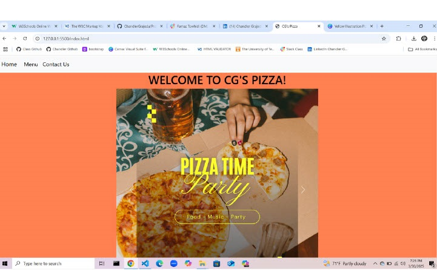
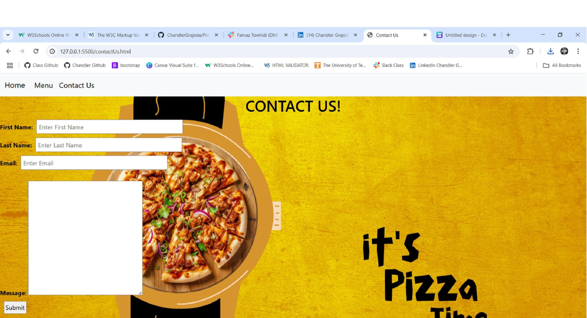
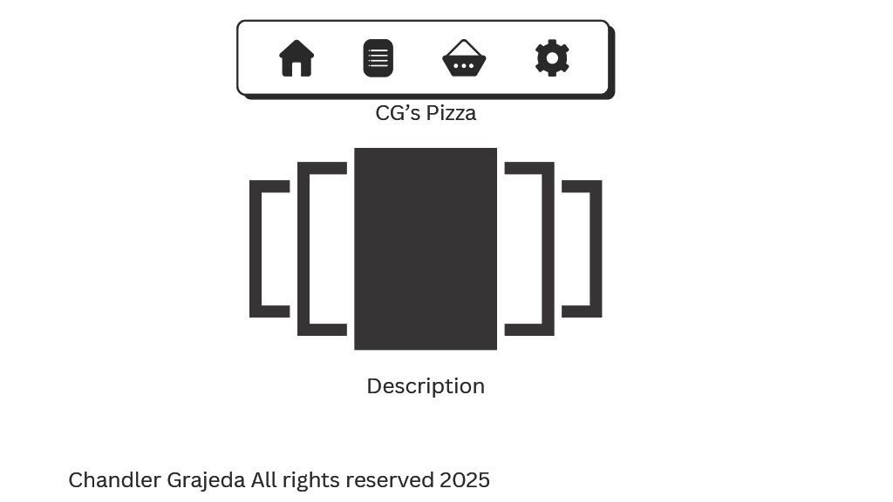

# CG's Pizza

CG's Pizza is where you can get all of the favorite styles of pizza for an affordable cost. 
The website is displays a home page telling about the website, a menu page for whats available to buy, and a contact us page for any kind of feedback or concern directly to the owner.

# Screen Shot

    
# Technologies Used:
- Html
- CSS
- Bootstrap

# User Stories:

1. As a user, I want to view the different kinds of pizza offered on the menu page and choose what I want.
2. As a user, I want to be able to submit a concern, claim, or review by contacting CG's pizza owner.
3. As a user, I want to be able to navigate between the different pages by using the navbar if I ever want to go back.

# Wireframe

# Next Steps:

1. Implement user accounts, letting them to be able to sign in and save their info like email, password, address, etc.
2. Add a build your own section/page incase the customer wants something different that isn't listed.
3. location section to the home page so if the customer wants to come to the shop instead of ordering online.
4. Add a cart option for multiple selections in one order.

# Author

[Chandler Grajeda](https://www.linkedin.com/in/chandler-grajeda-57289a292/)